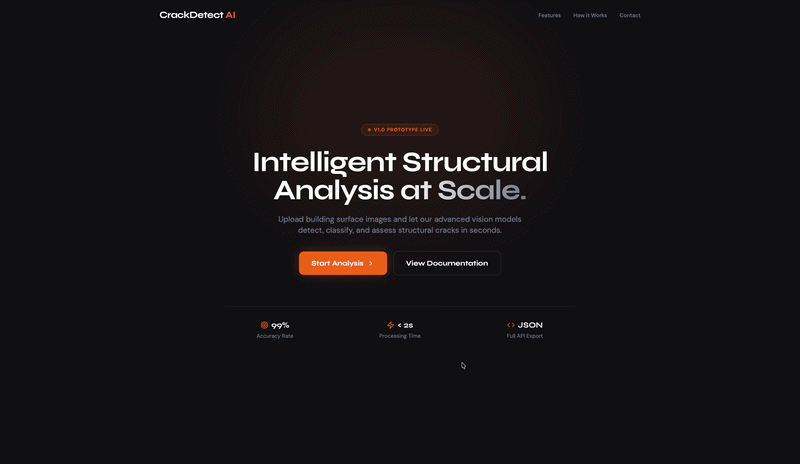
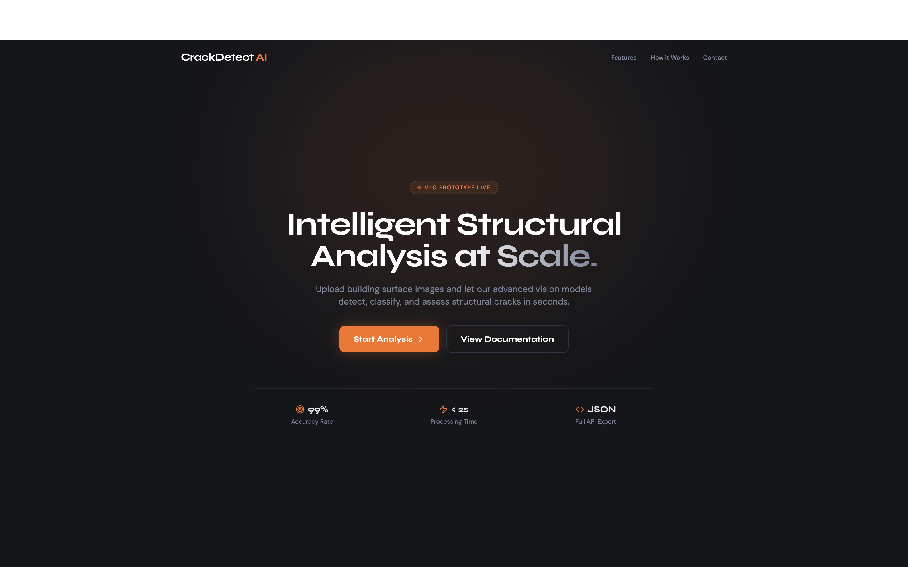
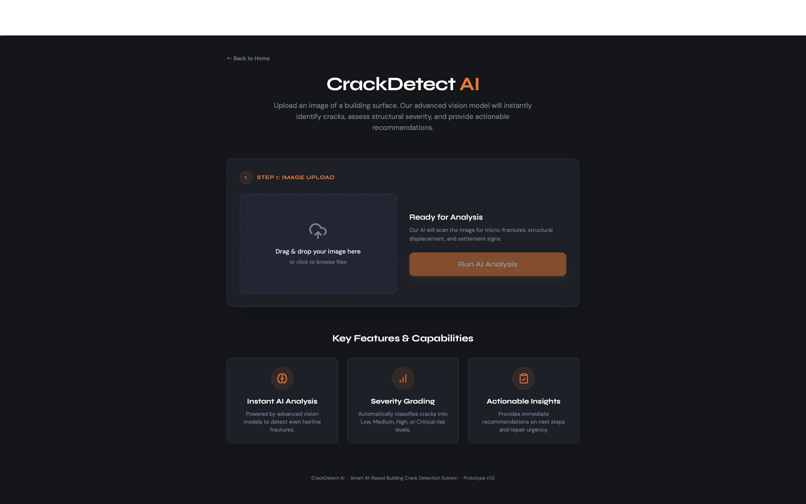

# 🏗️ CrackDetect AI: Intelligent Structural Analysis

[](#)
[](#)
[](#)

**CrackDetect AI** is a professional-grade structural health monitoring tool that leverages advanced computer vision to identify, analyze, and grade building cracks in real-time. Designed for civil engineers and safety inspectors, it provides instant diagnostic reports and actionable repair recommendations.

---

## 📸 Live Demo

<p align="center">
  
</p>

*The video above demonstrates the full workflow: from the landing page to image upload, real-time AI processing buffer, and final structural diagnostic results.*

---

## 🚀 Key Features

* **Intelligent Vision:** Detects micro-fractures and structural displacement using Gemini 2.5 Flash.
* **Severity Grading:** Automatically classifies risks into **Low**, **Medium**, **High**, or **Critical**.
* **Instant Recommendations:** Generates actionable next steps based on structural engineering logic.
* **Modern UI/UX:** Built with React and Tailwind CSS, featuring a premium dark theme with "Syne" and "DM Sans" typography.
* **Processing Buffer:** Includes a full-screen blurred loading overlay for a seamless professional feel.

---

## 🖼️ Interface Gallery

<p align="center">
  
  
</p>

---

## 🛠️ Technical Stack

**Frontend:**
* **React.js** - UI Component logic
* **Tailwind CSS** - Modern styling and layout
* **Lucide React** - High-quality iconography

**Backend:**
* **Node.js & Express** - Server architecture
* **Google Generative AI** - Gemini 2.5 Flash Vision API
* **Multer** - Secure image buffer handling

---

## ⚙️ Installation & Setup

1. **Clone the repository:**
   ```bash
   git clone [https://github.com/Ak1Anniee/AI-crack-detection.git](https://github.com/Ak1Anniee/AI-crack-detection.git)
   cd AI-crack-detection
2. **Install dependencies:**
   ```bash
   npm install


3. **Configure Environment Variables:**

   Create a .env file in the root directory:
   ```bash
   GEMINI_API_KEY=your_api_key_here
   PORT=3001


4. **Run the Application:**
   ```bash
   npm start

   The frontend will open at http://localhost:5173 and the backend will run at http://localhost:3001.

---

## 📝 Disclaimer:

This tool is a prototype designed for educational and preliminary assessment purposes. It is not a replacement for a professional inspection by a licensed structural engineer.

---
**Developed by [Aniruddh Kumar](https://github.com/Ak1Anniee)**
